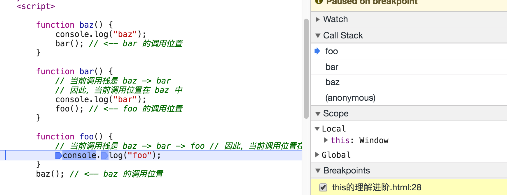

 this是javascript中最常用到的关键词之一， javascript中this对象的指向问题是一个很重要的问题，理解并正确使用它是一个javascript开发者必须具备的能力。
> this 实际上是在函数被调用时发生的绑定，它指向什么完全取决于函数在哪里被调用。

### 调用位置
在理解 this 的绑定过程之前，首先要理解调用位置:调用位置就是函数在代码中被调用的 位置(而不是声明的位置)。只有仔细分析调用位置才能回答这个问题:这个 this 到底引 用的是什么?
> 最重要的是要分析调用栈(就是为了到达当前执行位置所调用的所有函数)。我们关心的 调用位置就在当前正在执行的函数的前一个调用中。调用栈可以想象成一个函数调用链，在浏览器的调试工具中可以打断点来查看当前断点的调用栈信息


可以看到当前调用栈的位置在foo,下个调用位置是bar,在当前的调用环境下this 默认指向了windows对象。

### 绑定规则
我们来看看在函数的执行过程中调用位置如何决定 this 的绑定对象。
你必须找到调用位置，然后判断需要应用下面四条规则中的哪一条。我们首先会分别解释 这四条规则，然后解释多条规则都可用时它们的优先级如何排列。

#### 默认绑定
首先要介绍的是最常用的函数调用类型:独立函数调用。可以把这条规则看作是无法应用其他规则时的默认规则。
```js
 function foo() {
    console.log(this.a);
 }
 var a = 2; 
 foo(); // 2
```
声明在全局作用域中的变量(比如 var a = 2)就是全局对象的一个同名属性。它们本质上就是同一个东西，并不是通过复制得到的。
当调用 foo() 时，this.a 被解析成了全局变量 a。因为函数调用时应用了 this 的默认绑定，因此 this 指向全局对象。

那么我们怎么知道这里应用了默认绑定呢?可以通过分析调用位置来看看 foo() 是如何调 用的。在代码中，foo() 是直接使用不带任何修饰的函数引用进行调用的，其调用栈是处在全局作用域中，因此只能使用 默认绑定，无法应用其他规则。

`注意` ：使用严格模式(strict mode)，那么全局对象将无法使用默认绑定，因此 this 会绑定到undefined。

#### 隐式绑定
另一条需要考虑的规则是调用位置是否有上下文对象，或者说是否被某个对象拥有或者包含。
```js
function foo() { 
    console.log( this.a );
}
var obj = { 
    a: 2,
    foo: foo
 };
 obj.foo(); // 2
```
首先需要注意的是 foo() 的声明方式，及其之后是如何被当作引用属性添加到 obj 中的。 但是无论是直接在 obj 中定义还是先定义再添加为引用属性，这个函数严格来说都不属于 obj 对象。

然而，调用位置会使用 obj 上下文来引用函数，因此你可以说函数被调用时 obj 对象“拥 有”或者“包含”它。

无论你如何称呼这个模式，当 foo() 被调用时，它的落脚点确实指向 obj 对象。当函数引 用有上下文对象时，隐式绑定规则会把函数调用中的 this 绑定到这个上下文对象。因为调 用 foo() 时 this 被绑定到 obj，因此 this.a 和 obj.a 是一样的。

对象属性引用链中只有最顶层或者说最后一层会影响调用位置。举例来说:
```js
 function foo() {
     console.log(this.a);
 }
 var obj2 = {
     a: 42,
     foo: foo
 };
 var obj1 = {
    a: 2,
     obj2: obj2
 };
obj1.obj2.foo(); // 42
```
#### 隐式丢失
当我们在用隐式绑定的时候可能会犯一个错误，被隐式绑定的函数会丢失绑定对象，也就是说它会应用默认绑定，从而把 this 绑定到全局对象或者undefined 上，取决于是否是严格模式。
```js
 function foo() {
     console.log(this.a);
 }
 var obj = {
     a: 2,
     foo: foo
 };
 var bar = obj.foo; // 函数别名!
 var a = "oops, global"; // a 是全局对象的属性 
 bar(); // "oops, global"
```
虽然 bar 是 obj.foo 的一个引用，但是实际上，它引用的是 foo 函数本身，因此此时的 bar() 其实是一个不带任何修饰的函数调用，因此应用了默认绑定。

#### 显式绑定
在分析隐式绑定时，我们必须在一个对象内部包含一个指向函数的属性，并通过这个属性间接引用函数，从而把 this 间接(隐式)绑定到这个对象上。 那么如果我们不想在对象内部包含函数引用，而想在某个对象上强制调用函数，该怎么做呢?

JavaScript 中的“所有”函数都有一些有用的特性可以用来解决这个问题。具体点说，可以使用函数的 call(..) 和 apply(..) 方法。严格来说，JavaScript 的宿主环境有时会提供一些非常特殊的函数，它们 并没有这两个方法。但是这样的函数非常罕见，JavaScript 提供的绝大多数函数以及你自 己创建的所有函数都可以使用call(..) 和 apply(..) 方法。
```js
function foo() { 
    console.log( this.a );
}
var obj = {
     a:2
};
foo.call( obj ); // 2
```
通过 foo.call(..)，我们可以在调用 foo 时强制把它的 this 绑定到 obj 上。
