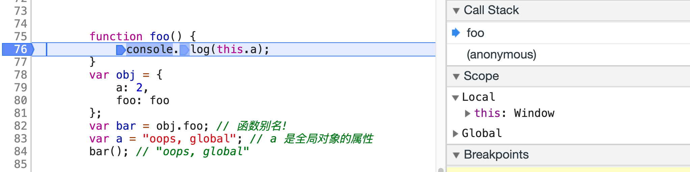
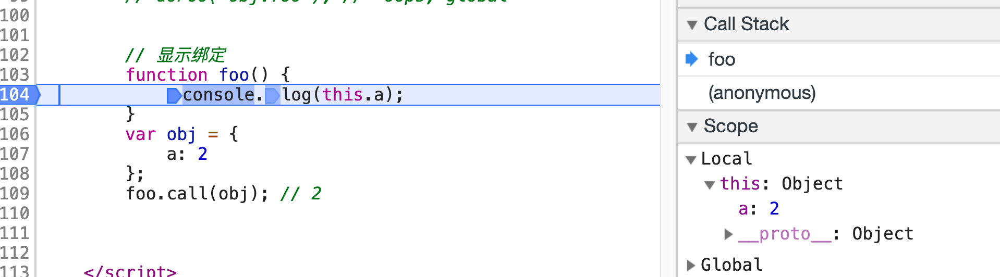

this是javascript中最常用到的关键词之一， javascript中this对象的指向问题是一个很重要的问题，理解并正确使用它是一个javascript开发者必须具备的能力。

> this 实际上是在函数被调用时发生的绑定，它指向什么完全取决于函数在哪里被调用。

# 调用位置

在理解 this 的绑定过程之前，首先要理解调用位置:调用位置就是函数在代码中被调用的 位置(而不是声明的位置)。只有仔细分析调用位置才能回答这个问题:这个 this 到底引 用的是什么?

> 最重要的是要分析调用栈(就是为了到达当前执行位置所调用的所有函数)。我们关心的 调用位置就在当前正在执行的函数的前一个调用中。调用栈可以想象成一个函数调用链，在浏览器的调试工具中可以打断点来查看当前断点的调用栈信息

 
可以看到当前调用栈的位置在foo,下个调用位置是bar,在当前的调用环境下this 默认指向了windows对象。

# 绑定规则

我们来看看在函数的执行过程中调用位置如何决定 this 的绑定对象。 你必须找到调用位置，然后判断需要应用下面四条规则中的哪一条。我们首先会分别解释 这四条规则，然后解释多条规则都可用时它们的优先级如何排列。

## 默认绑定

首先要介绍的是最常用的函数调用类型:独立函数调用。可以把这条规则看作是无法应用其他规则时的默认规则。

```javascript
function foo() {
    console.log(this.a);
 }
 var a = 2; 
 foo(); // 2
```

声明在全局作用域中的变量(比如 var a = 2)就是全局对象的一个同名属性。它们本质上就是同一个东西，并不是通过复制得到的。 当调用 foo() 时，this.a 被解析成了全局变量 a。因为函数调用时应用了 this 的默认绑定，因此 this 指向全局对象。

那么我们怎么知道这里应用了默认绑定呢?可以通过分析调用位置来看看 foo() 是如何调 用的。在代码中，foo() 是直接使用不带任何修饰的函数引用进行调用的，其调用栈是处在全局作用域中，因此只能使用 默认绑定，无法应用其他规则。

`注意` ：使用严格模式(strict mode)，那么全局对象将无法使用默认绑定，因此 this 会绑定到undefined。

## 隐式绑定

另一条需要考虑的规则是调用位置是否有上下文对象，或者说是否被某个对象拥有或者包含。

```javascript
function foo() { 
    console.log( this.a );
}
var obj = { 
    a: 2,
    foo: foo
 };
 obj.foo(); // 2
```

首先需要注意的是 foo() 的声明方式，及其之后是如何被当作引用属性添加到 obj 中的。 但是无论是直接在 obj 中定义还是先定义再添加为引用属性，这个函数严格来说都不属于 obj 对象。

然而，调用位置会使用 obj 上下文来引用函数，因此你可以说函数被调用时 obj 对象"拥 有"或者"包含"它。

无论你如何称呼这个模式，当 foo() 被调用时，它的落脚点确实指向 obj 对象。当函数引 用有上下文对象时，隐式绑定规则会把函数调用中的 this 绑定到这个上下文对象。因为调 用 foo() 时 this 被绑定到 obj，因此 this.a 和 obj.a 是一样的。

对象属性引用链中只有最顶层或者说最后一层会影响调用位置。举例来说:

```javascript
function foo() {
     console.log(this.a);
 }
 var obj2 = {
     a: 42,
     foo: foo
 };
 var obj1 = {
    a: 2,
     obj2: obj2
 };
obj1.obj2.foo(); // 42
```

## 隐式丢失

当我们在用隐式绑定的时候可能会犯一个错误，被隐式绑定的函数会丢失绑定对象，也就是说它会应用默认绑定，从而把 this 绑定到全局对象或者undefined 上，取决于是否是严格模式。

```javascript
function foo() {
     console.log(this.a);
 }
 var obj = {
     a: 2,
     foo: foo
 };
 var bar = obj.foo; // 函数别名!
 var a = "oops, global"; // a 是全局对象的属性 
 bar(); // "oops, global"
```

虽然 bar 是 obj.foo 的一个引用，但是实际上，它引用的是 foo 函数本身，因此此时的 bar() 其实是一个不带任何修饰的函数调用，因此应用了默认绑定。 

## 显式绑定

在分析隐式绑定时，我们必须在一个对象内部包含一个指向函数的属性，并通过这个属性间接引用函数，从而把 this 间接(隐式)绑定到这个对象上。 那么如果我们不想在对象内部包含函数引用，而想在某个对象上强制调用函数，该怎么做呢?

JavaScript 中的"所有"函数都有一些有用的特性可以用来解决这个问题。具体点说，可以使用函数的 call(..) 和 apply(..) 方法。严格来说，JavaScript 的宿主环境有时会提供一些非常特殊的函数，它们 并没有这两个方法。但是这样的函数非常罕见，JavaScript 提供的绝大多数函数以及你自 己创建的所有函数都可以使用call(..) 和 apply(..) 方法。

```javascript
function foo() { 
    console.log( this.a );
}
var obj = {
     a:2
};
foo.call( obj ); // 2
```

通过 foo.call(..)，我们可以在调用 foo 时强制把它的 this 绑定到 obj 上。 

## 硬绑定

显式绑定仍然无法解决我们之前提出的丢失绑定问题,但是显式绑定的一个变种可以解决这个问题。

```javascript
function foo() {
    console.log(this.a);
}
var obj = {
    a: 2
};
var bar = function () {
    foo.call(obj);
};
bar(); // 2
setTimeout(bar, 100); // 2
// 硬绑定的 bar 不可能再修改它的 this 
bar.call(window); // 2
```

我们创建了函数 bar()，并在它的内部手动调用 了 foo.call(obj)，因此强制把 foo 的 this 绑定到了 obj。无论之后如何调用函数 bar，它 总会手动在 obj 上调用 foo。这种绑定是一种显式的强制绑定，因此我们称之为硬绑定。

硬绑定的典型应用场景就是创建一个包裹函数，传入所有的参数并返回接收到的所有值:

```javascript
function foo(something) {
    console.log(this.a, something); return this.a + something;
}
var obj = {
     a: 2
};
 var bar = function () {
     return foo.apply(obj, arguments);
};
 var b = bar(3); // 2 3 
 console.log(b); // 5
```

### new绑定

在传统的面向类的语言中，"构造函数"是类中的一些特殊方法，使用 new 初始化类时会 调用类中的构造函数。通常的形式是这样的:

```javascript
something = new MyClass(..);
```

JavaScript 也有一个 new 操作符，使用方法看起来也和那些面向类的语言一样，绝大多数开 发者都认为 JavaScript 中 new 的机制也和那些语言一样。然而，JavaScript 中 new 的机制实 际上和面向类的语言完全不同。

首先我们重新定义一下 JavaScript 中的"构造函数"。在 JavaScript 中，构造函数只是一些 使用 new 操作符时被调用的函数。它们并不会属于某个类，也不会实例化一个类。实际上， 它们甚至都不能说是一种特殊的函数类型，它们只是被 new 操作符调用的普通函数而已。 举例来说，思考一下 Number(..) 作为构造函数时的行为，ES5.1 中这样描述它:

> 15.7.2 Number 构造函数当 Number 在 new 表达式中被调用时，它是一个构造函数:它会初始化新创建的 对象。

所以，包括内置对象函数(比如 Number(..))在内的所有函数都可 以用 new 来调用，这种函数调用被称为构造函数调用。这里有一个重要但是非常细微的区 别:实际上并不存在所谓的"构造函数"，只有对于函数的"构造调用"。 使用 new 来调用函数，或者说发生构造函数调用时，会自动执行下面的操作。

1. 创建(或者说构造)一个全新的对象。
2. 这个新对象会被执行[[原型]]连接。
3. 这个新对象会绑定到函数调用的this。
4. 如果函数没有返回其他对象，那么new表达式中的函数调用会自动返回这个新对象。

```javascript
function foo(a) {
    this.a = a;
}
var bar = new foo(2);
console.log(bar.a); // 2
```

使用 new 来调用 foo(..) 时，我们会构造一个新对象并把它绑定到 foo(..) 调用中的 this 上。new 是最后一种可以影响函数调用时 this 绑定行为的方法，我们称之为 new 绑定。

### 优先级

现在我们已经了解了函数调用中 this 绑定的四条规则，你需要做的就是找到函数的调用位 置并判断应当应用哪条规则。但是，如果某个调用位置可以应用多条规则该怎么办?为了 解决这个问题就必须给这些规则设定优先级，这就是我们接下来要介绍的内容。毫无疑问，默认绑定的优先级是四条规则中最低的，所以我们可以先不考虑它。

隐式绑定和显式绑定哪个优先级更高?我们来测试一下:

```javascript
function foo() {
    console.log(this.a);
}
var obj1 = {
     a: 2,
    foo: foo
 };
var obj2 = {
    a: 3,
    foo: foo
};
obj1.foo(); // 2
obj2.foo(); // 3
obj1.foo.call(obj2); // 3
obj2.foo.call(obj1); // 2
```

可以看到，显式绑定优先级更高，也就是说在判断时应当先考虑是否可以应用显式绑定。

现在我们需要搞清楚 new 绑定和隐式绑定的优先级谁高谁低:

```javascript
function foo(something) {
    this.a = something;
}
var obj1 = {
    foo: foo
};
var obj2 = {};
obj1.foo(2);
console.log(obj1.a); // 2
obj1.foo.call(obj2, 3);
console.log(obj2.a); // 3
var bar = new obj1.foo(4);
console.log(obj1.a); // 2 
console.log(bar.a); // 4
```

可以看到 new 绑定比隐式绑定优先级高。但是 new 绑定和显式绑定谁的优先级更高呢?
> new 和 call/apply 无法一起使用，因此无法通过 new foo.call(obj1) 来直接 进行测试。但是我们可以使用硬绑定来测试它俩的优先级。

```js
function foo(something) {
    this.a = something;
}
var obj1 = {};
var bar = foo.bind(obj1); bar(2);
console.log(obj1.a); // 2
var baz = new bar(3);
console.log(obj1.a); // 2 
console.log(baz.a); // 3
```
出乎意料! bar 被硬绑定到 obj1 上，但是 new bar(3)并没有向我们预料的那样把obj1.a修改为 3。相反，new 修改了硬绑定(到 obj1 的)调用 bar(..) 中的 this。因为使用了 new 绑定，我们得到了一个名字为 baz 的新对象，并且 baz.a 的值是 3。

#### 判断this

现在我们可以根据优先级来判断函数在某个调用位置应用的是哪条规则。可以按照下面的 顺序来进行判断:
1. 函数是否在new中调用(new绑定)?如果是的话this绑定的是新创建的对象。 var bar = new foo()
2. 函数是否通过call、apply(显式绑定)或者硬绑定调用?如果是的话，this绑定的是 指定的对象。 var bar = foo.call(obj2)
3. 函数是否在某个上下文对象中调用(隐式绑定)?如果是的话，this 绑定的是那个上 下文对象。 var bar = obj1.foo()
4. 如果都不是的话，使用默认绑定。如果在严格模式下，就绑定到undefined，否则绑定到 全局对象。 var bar = foo() 就是这样。

对于正常的函数调用来说，理解了这些知识你就可以明白 this 的绑定原理了。 不过......凡事总有例外。
